# 📊 FinTrack Pro — Personal Finance Tracker

> **Your smart, secure, and modern solution for tracking, analyzing, and managing personal finances.**

<p align="center">
  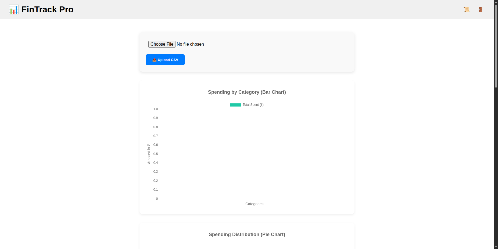
</p>

---

## 🚀 Live Demo
🔗 **Website:** [sonisales.com](https://sonisales.com)  
*(Frontend hosted on Vercel, Backend API powered by Render)*  

**⚠️ Note:** On first registration, after clicking the **Register** button, please wait **at least 1 minute** before the action completes.  
This delay is due to the free-tier hosting on Render, where the server may need to spin up from an idle state.

---

## ✨ Features

### 🔐 Authentication
<p align="center">
  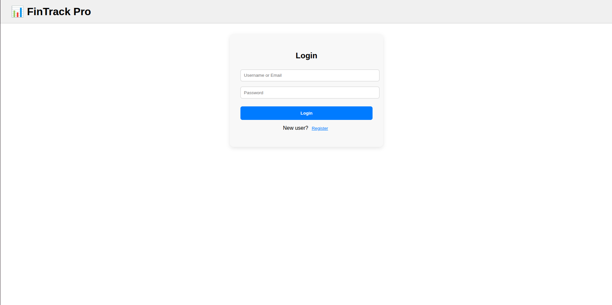
</p>  

- Secure **user registration** and **login**.
- Passwords hashed using **Flask-Bcrypt**.
- **JWT-based authentication** for all protected API routes.

---

### 📁 CSV Upload & Auto Categorization
<p align="center">
  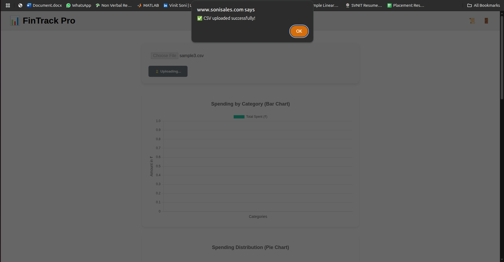
</p>  

- Upload **bank transaction CSV files** with columns:  
  `Date, Description, Amount`
- Automatic expense categorization using the **`predict_category`** model.
- Handles **large CSVs (10,000+ rows)** with **chunked database inserts** for efficiency.

---

### 📜 Transaction Management
<p align="center">
  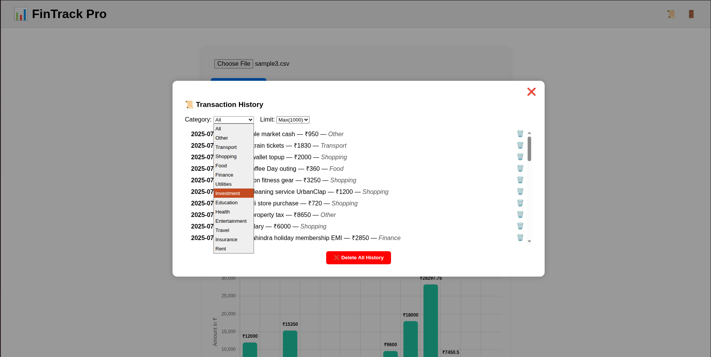
  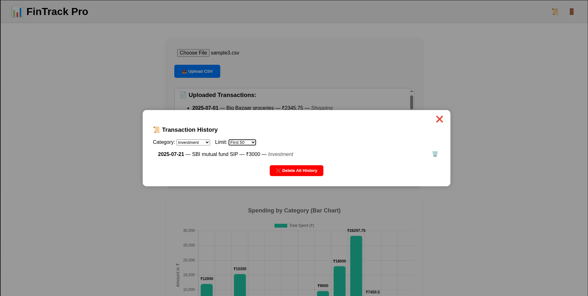
  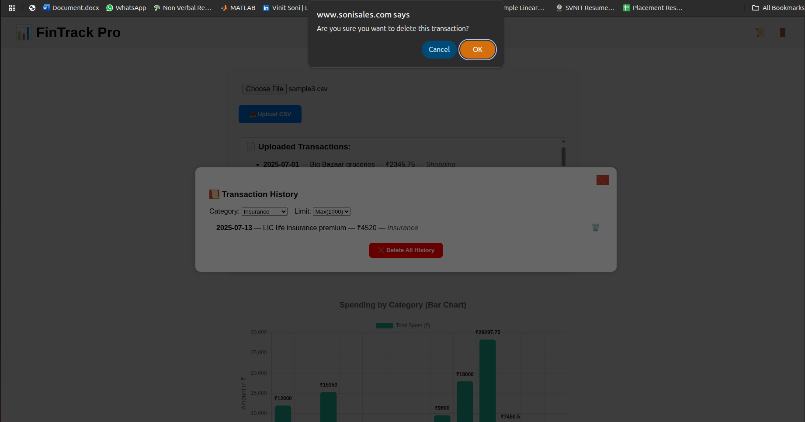
</p>  

- View **paginated transaction history**.
- **Delete** single transactions or **clear all** instantly.
- Search, filter, and sort transactions directly from the UI.

---

### 📈 Summary & Analytics
<p align="center">
  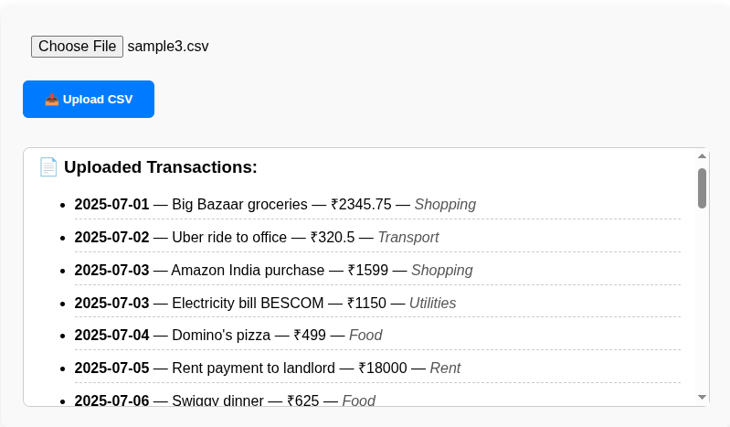
  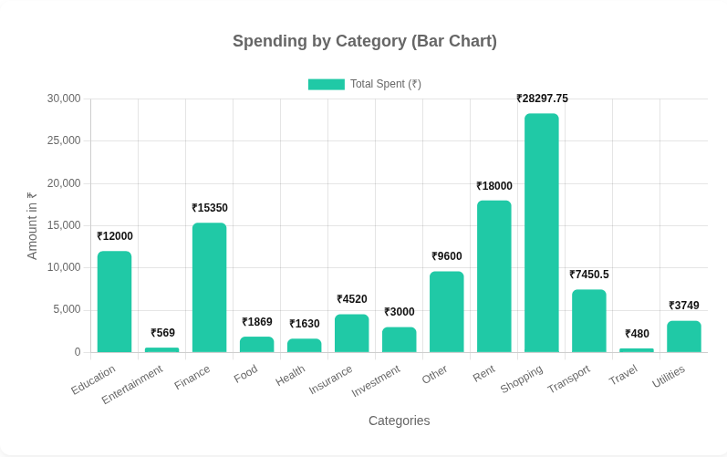
  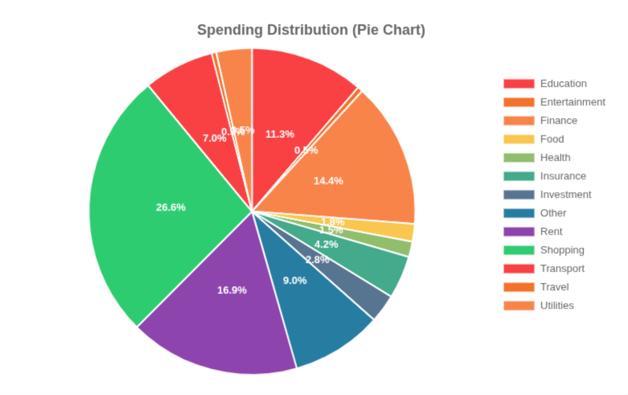
  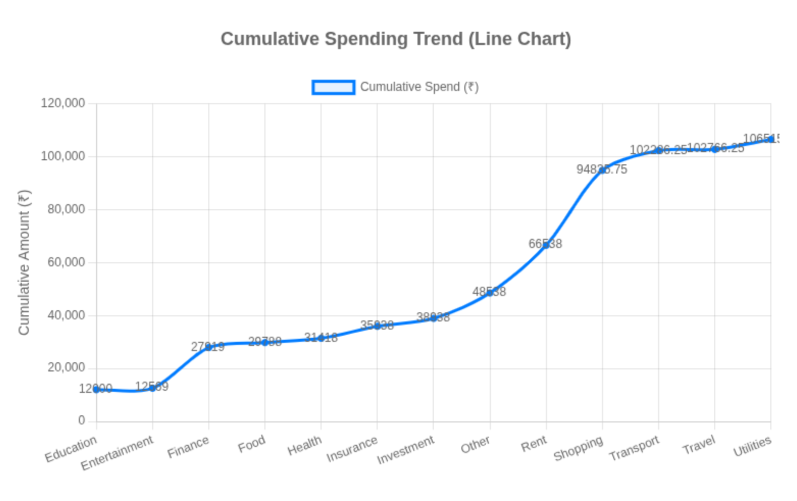
  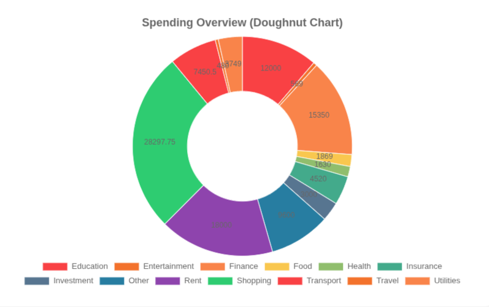
  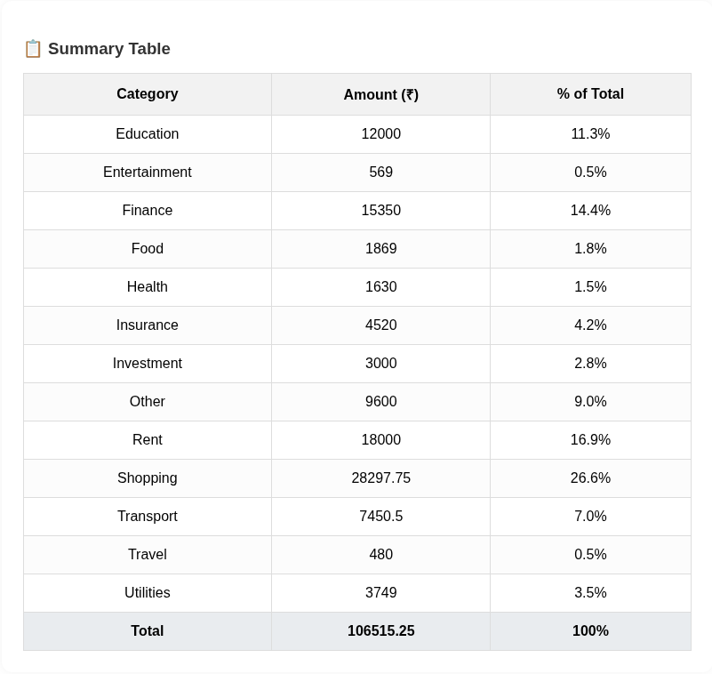
</p>  

- Category-wise **spending summaries**.
- Seamless integration with **charts** for visual analytics.
- Export data for **budgeting reports**.

---

## 🛠 Tech Stack

**Backend (Flask API)**  
- 🐍 **Flask** — Python micro-framework.  
- 🗄 **Flask-SQLAlchemy** — ORM for PostgreSQL.  
- 🔐 **Flask-Bcrypt** — Secure password hashing.  
- 🔑 **PyJWT** — JWT authentication.  
- 📊 **pandas** — CSV parsing and processing.  
- 🚀 **gunicorn** — WSGI server for production.  

**Frontend**  
- ⚛ **React.js** — Single-page application.  
- 📡 **Axios** — HTTP requests.  
- 🎨 **TailwindCSS** — Utility-first CSS framework.  

**Hosting**  
- 🌐 **Frontend**: Vercel  
- 🔌 **Backend API**: Render  
- 💾 **Database**: PostgreSQL (Render)  

---

## 📂 Project Structure

```plaintext
fintrack-pro/
│
├── server/          # 🖥 Flask API backend
├── client/          # 🎨 React frontend
├── docs/            # 📄 Sample csv files
├── assets/          # 🖼 Project screenshots
│   ├── dashboard.png
│   ├── login.png
│   ├── sampleUpload.png
│   ├── sampleHistory.png
│   ├── sampleHistory2.png
│   ├── sampleHistory3.png
│   ├── sampleAnalytics.png
│   ├── sampleAnalytics2.png
│   ├── sampleAnalytics3.png
│   ├── sampleAnalytics4.png
│   ├── sampleAnalytics5.png
│   ├── sampleAnalytics6.png
└── README.md       
```

---

## ⚡ Large CSV Handling

FinTrack Pro is optimized for **big datasets**:  
- **Chunked inserts** → Processes transactions in batches to reduce memory load.  
- **Streaming uploads** → Prevents blocking API during large file processing.  
- **Optimized indexing** → PostgreSQL indexes on `user_id` & `date` for faster queries.  
- **Encoding fallback** → Supports UTF-8 & ISO-8859-1 CSV formats.  

**Performance:**  
- 10,000+ rows → Processed in **<10 seconds** on Render (in paid tier).  
- 50MB CSV → Handled without server crash.  

---

## 📌 API Endpoints

| Method | Endpoint                       | Auth | Description               |
| ------ | ------------------------------ | ---- | ------------------------- |
| POST   | `/api/register`                | ❌   | Register a new user       |
| POST   | `/api/login`                   | ❌   | Login & receive JWT token |
| GET    | `/api/hello`                   | ❌   | Health check endpoint     |
| POST   | `/api/upload-csv`              | ✅   | Upload & process CSV      |
| GET    | `/api/history`                 | ✅   | Get transaction history   |
| GET    | `/api/summary`                 | ✅   | Get category summary      |
| DELETE | `/api/delete-transaction/<id>` | ✅   | Delete one transaction    |
| DELETE | `/api/delete-all-transactions` | ✅   | Delete all transactions   |

---

👨‍💻 **Author:**  
VINIT CHANDRAPRAKASH SONI  
🌐 sonisales.com • 💻 GitHub